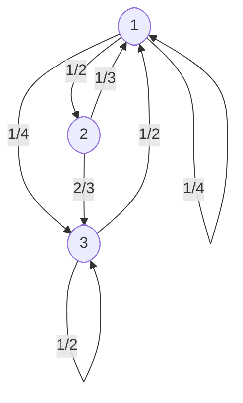

# Discrete Time Markov Chain
Let $\left\{X_n, n\geq 0 \right\}$ be a stochastic process taking values in a state space $S$ that has $N$ states. such a stochastic process is a Markov processes if it satisfies a following property : 

$$P(X_{n+1}=k_{n+1}|X_n = k_{n}, X_{n-1} = k_{n-1},...X_{1} = k_{1})=P(X_{n+1}=k_{n+1}|X_n = k_{n})$$

If the state space of a Markov process is discrete, it's called a **Markov chain**.

To understand the behaviour of this process, we will need to calculate probabilities like, 
$$P\left[X_0 = i_0, X_1 = i_1, ..., X_n = i_n\right]$$ ..(1)

$\because P(A,B)=P(A)\cdot P(B|A)$, this can be computed by multiplying conditional probabilities as follows. 

$$= P(X_0=i_0)\cdot P(X_1=i_1|X_0=i_0) \cdot P(X_2=i_2|X_1 = i_1, X_0=i_0)...$$ $$P(X_n=i_n|X_{n-1} = i_{n-1}, X_{n-2} = i_{n-2}, ..., X_0=i_0)$$ ..(2)

  

